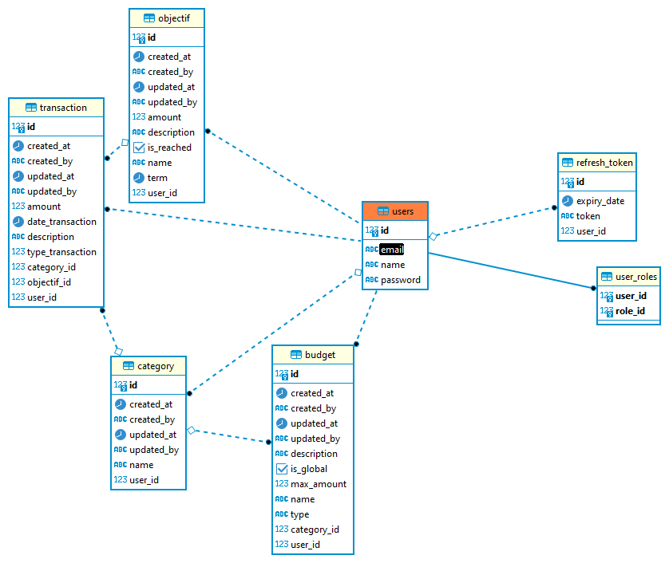

# BudgetPersonnel

Gestionnaire de budget personnel : développez une application Web permettant aux utilisateurs de suivre leurs dépenses
et leurs revenus, de définir des objectifs financiers et de recevoir des alertes en cas de dépassement de budget.
Intégrez des visualisations pour afficher l'évolution des dépenses et des économies.

## Installation

Les étapes pour installer le projet sont les suivantes :

1. Cloner le projet `git clone https://github.com/sahraoui9/budget-personnel.git`
2. Ouvrir un terminal dans le dossier du projet
3. Lancer la commande `mvn install -DskipTests`
4. Lancer la commande `docker-compose up --build`
5. Dans un navigateur, aller à l'adresse http://localhost:8080

## Utilisation

lien vers swagger : http://localhost:8080/swagger-ui.html

## Technologies utilisées

- Java 17
- Spring Boot 3
- Maven
- Docker / Docker-compose
- Postgres
- Swagger
- H2 (test)
- Github Actions
- SonarCloud
- Git

## Liste packages utilisés

Voici la liste des packages utilisés dans le projet Maven budget fourni :

- `spring-boot-starter-data-jpa` : package de démarrage pour Spring Data JPA
- `spring-boot-starter-security` : package de démarrage pour Spring Security
- `spring-boot-starter-web` : package de démarrage pour construire des applications web avec Spring MVC
- `spring-boot-starter-validation` : package de démarrage pour la validation Spring
- `postgresql` : pilote JDBC pour la base de données PostgreSQL
- `lombok` : bibliothèque pour réduire le code de routine
- `springdoc-openapi-starter-webmvc-ui` : package pour la génération de documentation OpenAPI
- `jjwt` : bibliothèque JSON Web Token
- `jaxb-api` : package pour travailler avec des données XML
- `opencsv` : package pour générer les fichiers CSV
- `itextpdf` : bibliothèque pour la génération de fichiers PDF
- `html2pdf` : bibliothèque pour la conversion de HTML en PDF
- `freemarker` : moteur de template pour la génération de sortie de texte
- `poi` : bibliothèque pour travailler avec des documents Microsoft Office pour la génération de fichiers Excel
- `spring-boot-starter-test` : package de démarrage pour les tests avec Spring Boot
- `spring-security-test` : package pour tester Spring Security
- `h2` : base de données en mémoire pour les tests
- `spring-boot-starter-mail` : package de démarrage pour l'envoi de courrier électronique.

## Liste des fonctionnalités
- Authentification : L'authentification est basée sur Spring Security et JWT. Lors de l'authentification, un token JWT est généré et envoyé dans le body de la réponse.
- Gestion des utilisateurs (modification du mot de passe, informations personnelles)
- Gestion des catégories de dépenses/revenus
- Gestion des transactions
- Gestion des objectifs
- Gestion des budgets
- Génération de fichiers CSV, PDF et Excel

## Architecture

L'architecture du projet est basée sur l'architecture Layered service. Elle est composée de 3 couches :
- La couche de présentation : contient les contrôleurs REST
- La couche métier : contient les services
- La couche d'accès aux données : contient les repositories et les entités

## CI/CD

Utilisation de github actions pour la CI/CD pour lancer les tests unitaires et d'intégration, et pour enregistrer les résultats dans SonarCloud.

## Qualité du code
- Utilisation de SonarLint et SonarCloud pour analyser le code et corriger les erreurs
- Lien vers SonarCloud : https://sonarcloud.io/summary/overall?id=sahraoui9_budget-personnel

## Tests
Les tests unitaires et d'intégration sont réalisés avec JUnit 5 et Mockito.

## Modèle de données
Voici le diagramme ER de la base de données :

## Auteurs

